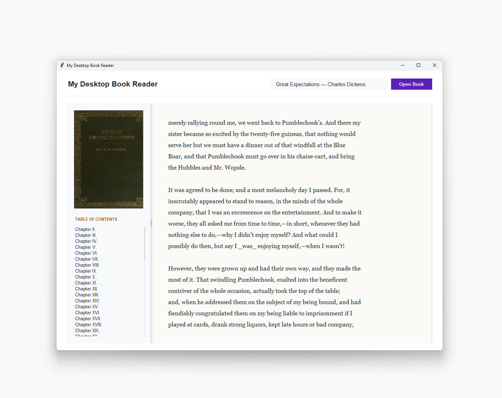

# My-Desktop-Book-Reader
A lightweight desktop application that downloads, structures, and renders text files from Project Gutenberg streams asynchronously.

<p align="center">
  
</p>

---

## Project Details
### Name
My Desktop Book Reader
### Version
1.0.0

---

## Description
This is a desktop-based e-reading application built with Python and Tkinter that utilizes an asynchronous pipeline to fetch public domain literature. By querying the Open Library API for search indexing and auto-suggestions, it pulls plain text files directly from Project Gutenberg streams. 

The application parses raw text metadata on the fly to construct an interactive Table of Contents, downloads book cover artwork in a background thread, and implements an interactive local dictionary lookup feature via a contextual right-click menu.

---

## Instructions to Run the App
### Prerequisites
Ensure you have Python 3.x installed along with the required image processing dependency:
```bash
pip install Pillow

```

### VS Code

1. Open the project folder in VS Code
2. Open `app.py`
3. Run the following command:

```bash
python app.py

```

### Terminal

1. Open your terminal application
2. Navigate to the project directory:

```bash
cd path/to/My-Desktop-Book-Reader

```

3. Run the following command:

```bash
python app.py

```

---

## Usage

1. **Search for a Book**: Click into the search bar and begin typing a classic title (e.g., "Dracula" or "Great Expectations").
2. **Select from Suggestions**: Click on an auto-suggestion result populated from the Open Library data stream.
3. **Load Text**: Click the **Open Book** button to pull the text and cover art asynchronously.
4. **Navigate**: Use the structured **Table of Contents** sidebar to quickly jump to specific chapters.
5. **Define Words**: Right-click (or two-finger tap) on any word within the reading canvas to instantly pull up its definition using the integrated dictionary popup.

---

## Features

* [x] **Asynchronous Networking**: Prevents the UI from freezing while downloading large text assets and images.
* [x] **Live Auto-Suggestion Engine**: Debounced search queries targeting Open Library APIs to find valid Project Gutenberg catalog matches.
* [x] **Dynamic TOC Parsing**: Utilizes regular expression patterns to isolate chapter structures from raw text formats on the fly.
* [x] **Contextual Dictionary Lookups**: Right-click binding that connects word selection with a secondary thread API definition wrapper.
* [x] **Modern UI/UX Restyling**: Custom-styled `ttk` layouts modifying standard widgets to feature rounded padding frames and minimalist scrollbar pill handles.
* [ ] **Local Offline Cache**: Saving previously downloaded books locally to read without an active internet connection.
* [ ] **E-Reader Bookmarking**: Storing the last read line position automatically per book asset ID.

---

## Additional Notes

* **API Dependencies**: This software relies on the public endpoints of `openlibrary.org`, `gutenberg.org`, and `api.dictionaryapi.dev`. Rate limiting or network disruptions on those servers may affect lookup performance.
* **Image Rendering**: If the `Pillow` library is missing, the core application will still functionalize and read text, but cover art canvas slots will default to a placeholder status message.
